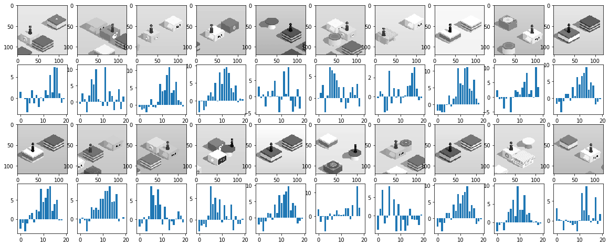
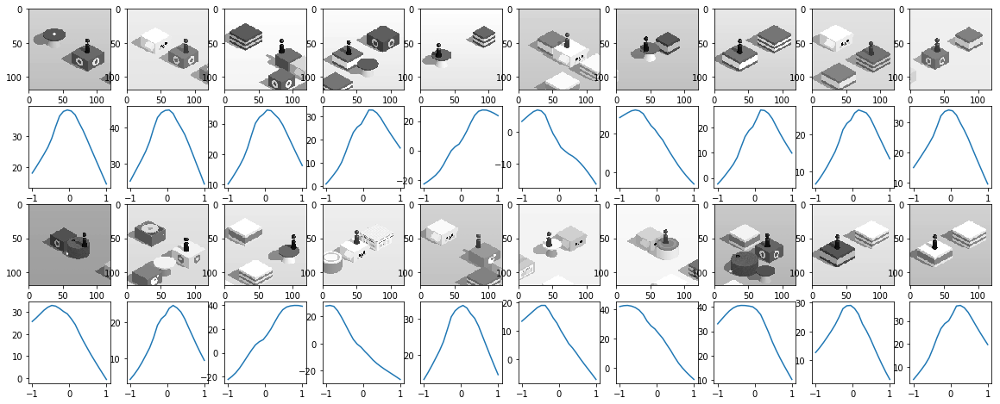

# deep-tiaotiao
用强化学习来玩微信跳一跳

本工程旨在实现一个端对端的跳一跳AI，直接读取屏幕图像作为输入，通过ADB控制手机完成跳一跳动作。基于强化学习进行训练。

使用与[Atari AI](https://github.com/bhaktipriya/Atari)相似的Qlearning算法，在训练800步后，成绩大约为100分（持续走大约50步不失败），训练用时约一个小时。使用DDPG算法效果更好一些。

运行环境为windows，python3.6（建议使用Anaconda），主要用到的库为Numpy，Matplotlib，TensorFlow，keras，OpenCV。ADB程序集成与ADB/文件夹中，需要手机打开USB调试，并且电脑有ADB驱动（最新Windows在插入手机后会自动安装）。

## 结果

QLearning在训练约800次后的效果图

DDPG在训练约800次后不同action对应的critic网络输出
